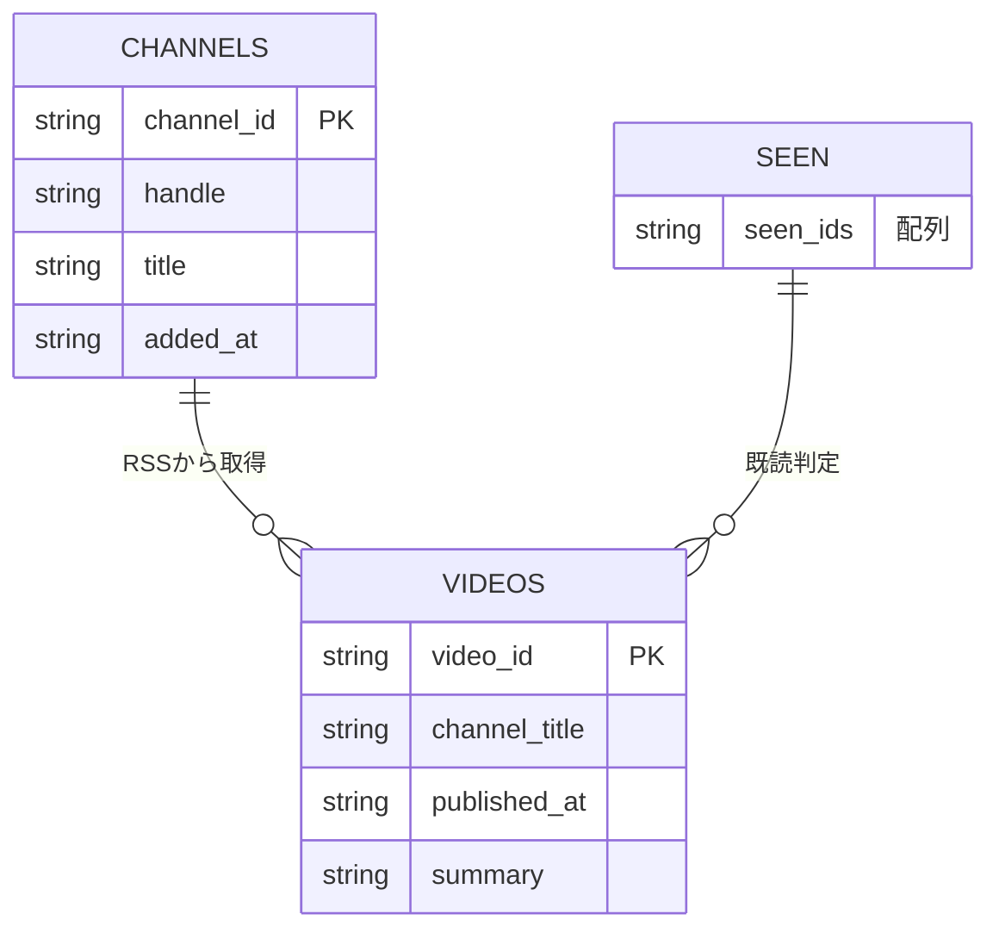
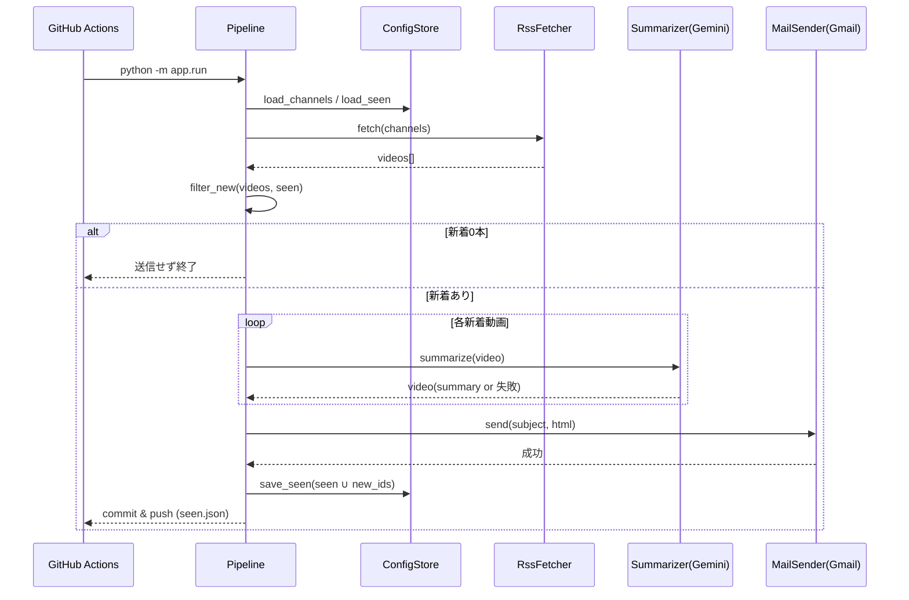
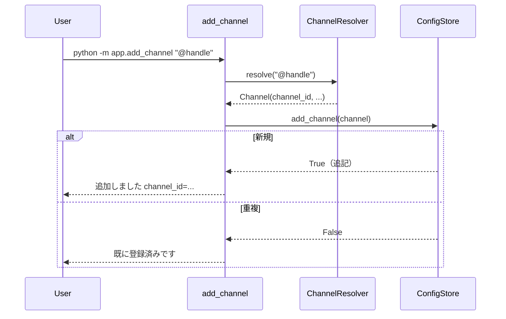

# 機能設計書 (Functional Design Document)

本書は `docs/product-requirements.md` で定義した要件を、技術的にどう実現するかを詳細化する。
本プロダクトは **決定的なパイプライン**（RSS 検出 → Gemini 要約 → HTML メール送信）であり、DB や Web サーバーを持たない。状態は JSON ファイルとしてリポジトリにコミットして永続化する。

## システム構成図

```mermaid
graph TB
    Cron[GitHub Actions<br/>scheduled workflow<br/>22:00 JST]
    subgraph Pipeline[決定的パイプライン app.run]
        Config[設定/状態ロード<br/>channels.json / seen.json]
        Fetch[新着検出<br/>RSS Fetcher]
        Diff[新着判定<br/>seen.json 差分]
        Summarize[要約<br/>Gemini Client]
        Compose[HTML 生成<br/>Mail Builder]
        Send[送信<br/>Gmail SMTP]
        Persist[状態書き戻し<br/>seen.json commit]
    end
    RSS[YouTube 無認証 RSS]
    Gemini[Gemini API]
    Gmail[Gmail SMTP]
    Inbox[受信トレイ<br/>you@example.com]

    Cron --> Config --> Fetch --> Diff --> Summarize --> Compose --> Send --> Persist
    Fetch <--> RSS
    Summarize <--> Gemini
    Send --> Gmail --> Inbox
```

補助ツールとして、監視チャンネルを追加する `app.add_channel`（@handle/URL → channel_id 解決）がある。

## 技術スタック

| 分類 | 技術 | 選定理由 |
|------|------|----------|
| 言語 | Python 3.11+ | RSS/HTTP/メール/JSON をライブラリで簡潔に扱え、GitHub Actions の標準ランナーで動く |
| RSS 取得 | `httpx`（または `requests`）+ `feedparser` | 無認証 RSS の取得とパースを安定して行える |
| 要約 | `google-genai`（Gemini API SDK） | YouTube URL を直接渡して要約でき、Claude 非使用の方針に合致 |
| メール | 標準ライブラリ `smtplib` / `email` | Gmail SMTP + アプリパスワードで追加依存なく送信できる |
| 実行基盤 | GitHub Actions（scheduled workflow） | サーバー不要・無料枠・cron 実行・Secrets 管理が揃う |
| 状態管理 | JSON ファイル（Git コミット） | DB 不要。取りこぼし・二重通知防止をシンプルに実現 |
| 設定 | JSON ファイル + 環境変数（Secrets） | 監視リストはコード管理、機密は Secrets 分離 |

## データモデル定義

DB は使わず、以下の JSON ファイルで状態・設定を保持する。

### エンティティ: Channel（監視チャンネル）

```typescript
interface Channel {
  channel_id: string;   // 例: "UCxxxxxxxxxxxxxxxxxxxxxx"（解決済み ID）
  handle: string;       // 例: "@handlename"（登録時の入力、表示・参照用）
  title: string;        // 追加時に RSS/解決から取得したチャンネル名（任意）
  added_at: string;     // ISO8601 追加日時
}
```

**制約**:
- `channel_id` はユニーク（重複追加不可）。
- 実行時は `channel_id` のみを使用し、handle の再解決は行わない。

### エンティティ: SeenState（既読状態）

```typescript
interface SeenState {
  seen_ids: string[];   // 通知済み YouTube 動画 ID の配列（例: "dQw4w9WgXcQ"）
}
```

**制約**:
- 送信成功後にのみ新着 ID を追記する。
- 肥大化防止のため、上限件数を超えた古い ID を切り詰めてよい（保持件数は運用で決定、例: 直近数千件）。

### エンティティ: Video（実行時のみのインメモリ表現）

```typescript
interface Video {
  video_id: string;        // YouTube 動画 ID
  title: string;           // タイトル
  channel_title: string;   // チャンネル名
  url: string;             // https://www.youtube.com/watch?v=<video_id>
  published_at: string;    // ISO8601 公開時刻
  rss_summary: string;     // RSS の概要欄（要約失敗時の代替表示に使用）
  summary: string | null;  // Gemini 要約（成功時）／null（失敗時）
  summary_ok: boolean;     // 要約成否
}
```

### ER図



## コンポーネント設計

### ConfigStore（設定・状態の読み書き）

**責務**:
- `channels.json` / `seen.json` のロードと保存。
- チャンネルの重複チェックと追記。

**インターフェース**:
```python
class ConfigStore:
    def load_channels(self) -> list[Channel]: ...
    def add_channel(self, channel: Channel) -> bool: ...   # 追加成功=True, 重複=False
    def load_seen(self) -> set[str]: ...
    def save_seen(self, seen_ids: set[str]) -> None: ...
```

**依存関係**: ファイルシステム（JSON）

### ChannelResolver（@handle/URL → channel_id 解決）

**責務**:
- 入力（@handle / チャンネル URL）から channel_id を一度だけ解決する。

**インターフェース**:
```python
class ChannelResolver:
    def resolve(self, handle_or_url: str) -> Channel: ...
```

**依存関係**: YouTube 公開ページ / RSS（無認証）

### RssFetcher（新着取得）

**責務**:
- 各 `channel_id` の無認証 RSS を取得・パースし、`Video` 一覧を返す。
- チャンネル単位の失敗を握りつぶし、他チャンネルの処理を継続する。

**インターフェース**:
```python
class RssFetcher:
    def fetch(self, channels: list[Channel]) -> list[Video]: ...
```

**依存関係**: `httpx` / `feedparser`

### 新着判定 filter_new（Pipeline 内ロジック）

**責務**:
- 取得した `Video` 群から、`seen.json` に無いものだけを抽出する。
- 独立クラスにはせず、`pipeline.py` 内の純粋関数として実装する（`docs/repository-structure.md` の配置と一致）。

**インターフェース**:
```python
def filter_new(videos: list[Video], seen: set[str]) -> list[Video]: ...
```

### Summarizer（Gemini 要約）

**責務**:
- YouTube URL を Gemini に直接渡し、日本語・構造化要約を生成する。
- 失敗時は `summary_ok=False` とし、代替表示に委ねる。

**インターフェース**:
```python
class Summarizer:
    def summarize(self, video: Video) -> Video: ...   # summary / summary_ok を埋めて返す
```

**依存関係**: `google-genai`（Gemini API キー）

### MailBuilder（HTML 生成）

**責務**:
- 新着 `Video` 群から1通分の HTML メール本文を生成する。

**インターフェース**:
```python
class MailBuilder:
    def build(self, videos: list[Video]) -> tuple[str, str]: ...  # (subject, html_body)
```

### MailSender（Gmail SMTP 送信）

**責務**:
- Gmail SMTP（アプリパスワード）で HTML メールを送信する。

**インターフェース**:
```python
class MailSender:
    def send(self, subject: str, html_body: str) -> None: ...  # 失敗時は例外
```

**依存関係**: `smtplib` / `email`（Gmail アプリパスワード）

### Pipeline（オーケストレーション）

**責務**:
- 上記コンポーネントを固定順で結線し、`app.run` のエントリを提供する。
- 送信成功後にのみ `seen.json` を更新する。

## ユースケース

### UC-1: 日次の新着要約通知（app.run）



**フロー説明**:
1. 設定（channels.json）と既読状態（seen.json）をロード。
2. 各チャンネルの RSS を取得して動画一覧を得る（チャンネル単位の失敗は継続）。
3. seen.json に無い動画だけを新着として抽出。
4. 新着0本なら送信せず終了（KPI: 0本日は0通）。
5. 各新着を Gemini で要約。失敗した動画は代替表示フラグを立てる。
6. HTML メールを1通生成して Gmail SMTP で送信。
7. **送信成功後にのみ** 新着 ID を seen.json に追記し、コミットして書き戻す。

### UC-2: 監視チャンネルの追加（app.add_channel）



## ファイル構造

**データ・設定の保存形式**:
```
config/
├── channels.json    # 監視チャンネル一覧（コミット管理）
state/
└── seen.json        # 通知済み動画 ID（コミット管理・実行毎に書き戻し）
```

**channels.json 例**:
```json
{
  "channels": [
    {
      "channel_id": "UCxxxxxxxxxxxxxxxxxxxxxx",
      "handle": "@handlename",
      "title": "チャンネル名",
      "added_at": "2026-07-08T22:00:00+09:00"
    }
  ]
}
```

**seen.json 例**:
```json
{
  "seen_ids": ["dQw4w9WgXcQ", "abcDEF12345"]
}
```

## UI設計（メール HTML）

**表示項目（動画1件あたり）**:
| 項目 | 説明 | フォーマット |
|------|------|-------------|
| タイトル | 動画タイトル（YouTube リンク付き） | `<a>` リンク見出し |
| チャンネル名 | 投稿チャンネル | テキスト |
| 公開時刻 | 公開日時 | `YYYY-MM-DD HH:MM (JST)` |
| 要約 | 小見出し付き構造化要約 | HTML（見出し＋本文） |
| 代替表示 | 要約失敗時 | `⚠️ 要約できませんでした` + RSS 概要欄 |

**件名**: 例 `【YouTube新着】YYYY-MM-DD 新着 N 本`

## Gemini 要約プロンプト設計（方針）

- 入力: YouTube URL（動画 part として直接渡す）。
- 出力: 日本語・小見出し付きの構造化要約（"観なくても分かる" 粒度）。
- 具体モデル（最新の要約向けモデル）とプロンプト文面はアーキテクチャ設計時／実装着手時に確定する。

## エラーハンドリング

| エラー種別 | 処理 | 結果への反映 |
|-----------|------|-------------|
| 一部チャンネルの RSS 取得失敗 | ログ出力し、当該チャンネルをスキップして継続 | 他チャンネル分は通常処理 |
| 動画要約失敗（メンバー限定/非公開/年齢制限/長すぎ/API エラー） | 例外を捕捉し `summary_ok=False` | `⚠️ 要約できませんでした` + RSS 概要欄で必ず通知に含める |
| Gemini API 全体障害 | 各動画が要約失敗として代替表示 | メールは送信（取りこぼしゼロ優先） |
| メール送信失敗 | 例外で異常終了、`seen.json` を更新しない | 翌日以降に再通知（リカバリ可能） |
| 設定/状態ファイル破損 | 明示エラーで停止 | 手動修正を促す |
| 解決不能な @handle / URL（add_channel） | 入力検証エラーで停止し、`channels.json` を変更しない | エラーメッセージで正しい形式を案内 |

## パフォーマンス最適化

- 要約は動画単位で行い、失敗が全体を止めないよう独立処理。
- 同一実行内の重複 video_id を排除してから要約に回す。
- 遅延は許容のため、レート制限に触れた場合は軽いリトライ／スリープで吸収（過剰な並列化はしない）。

## セキュリティ考慮事項

- Gemini API キー・Gmail アドレス・アプリパスワードは GitHub Secrets → 環境変数で受け取り、ファイルにもログにも残さない。
- `channels.json` / `seen.json` は機密を含まないためコミット可。
- 例外メッセージに機密が混入しないようログ出力を選別する。

## テスト戦略

### ユニットテスト
- filter_new（新着判定）: seen 差分ロジック（新着/既読/空）。
- ConfigStore: 重複チャンネルの追加拒否、seen の読み書き。
- MailBuilder: 要約成功/失敗（代替表示）両パターンの HTML 生成。
- ChannelResolver: @handle / URL のパース。

### 統合テスト
- RSS モックからの取得 → 差分抽出 → 要約（Gemini モック）→ HTML 生成までの結線。
- 新着0本のとき送信されないこと。

### E2Eテスト（手動 / workflow_dispatch）
- 実チャンネルで手動実行し、受信メールの体裁と、seen.json の書き戻し（二重通知が起きないこと）を確認。
