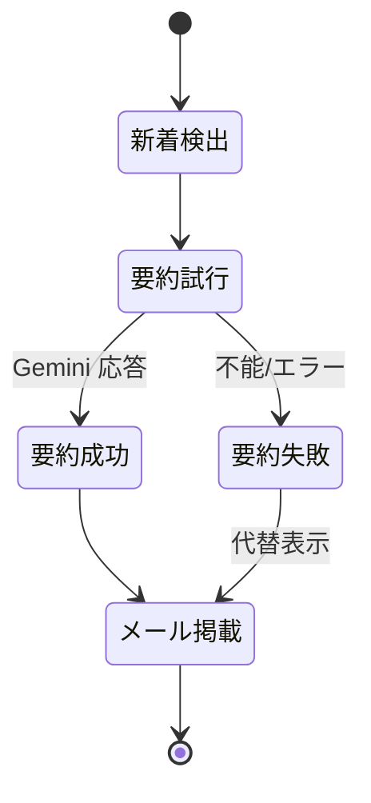

# プロジェクト用語集 (Glossary)

## 概要

このドキュメントは、YouTube 新着要約通知エージェントの各ドキュメント（PRD / 機能設計 / アーキテクチャ / リポジトリ構造 / 開発ガイドライン）で使用される用語を統一的に定義する。

**更新日**: 2026-07-08

## ドメイン用語

プロジェクト固有の概念・機能に関する用語。

### 監視チャンネル

**定義**: 新着動画を検出する対象として手動で登録した YouTube チャンネル。

**説明**: 登録一覧の自動追従はせず、`config/channels.json` に手動リストとして管理する。追加時に @handle / URL を一度だけ `channel_id` に解決し、実行時は解決済み ID のみを使用する。

**関連用語**: channel_id、既読 ID 記録方式

**使用例**:
- 「監視チャンネルを追加する」= `python -m app.add_channel "@handle"` を実行する。

**英語表記**: Watched Channel

### 新着動画

**定義**: 監視チャンネルの RSS に存在し、`seen.json` に未記録の動画。

**説明**: 「RSS にあってリストに無いもの」を新着とする。新着0本の日はメールを送信しない。

**関連用語**: 既読 ID 記録方式、seen.json

**使用例**:
- 「新着0本なら送信しない」。

**英語表記**: New Video

### 既読 ID 記録方式

**定義**: 通知済みの動画 ID を `seen.json` に保存し、差分だけを新着とみなす方式。

**説明**: 取りこぼしゼロ・二重通知ゼロを担保する中核の仕組み。状態はリポジトリにコミットして書き戻す。**メール送信成功後にのみ** ID を追記するため、送信前に失敗しても翌日リカバリできる。

**関連用語**: seen.json、状態書き戻し

**英語表記**: Seen-ID Tracking

### 要約不能動画（代替表示）

**定義**: Gemini が要約できない動画（メンバー限定 / 非公開 / 年齢制限 / 長すぎ / API エラー）。

**説明**: 「⚠️ 要約できませんでした」と明記し、RSS の概要欄を代替表示する。要約不能でもタイトル・チャンネル名・リンクは必ず通知に含める（取りこぼしゼロ）。

**関連用語**: 取りこぼしゼロ、summary_ok

**英語表記**: Unsummarizable Video / Fallback Display

### 取りこぼしゼロ

**定義**: RSS に現れた新着が、要約成否にかかわらず必ず通知に含まれること。

**説明**: プライマリー KPI の一つ。要約失敗時も代替表示で通知に載せることで実現する。

**関連用語**: 二重通知ゼロ、要約不能動画

### 二重通知ゼロ

**定義**: 一度通知した動画が再通知されないこと。

**説明**: プライマリー KPI の一つ。`seen.json` の既読管理で担保する。

**関連用語**: 既読 ID 記録方式

## 技術用語

### 無認証 RSS

**定義**: YouTube が公開しているチャンネル別の Atom フィード。`https://www.youtube.com/feeds/videos.xml?channel_id=…`。

**本プロジェクトでの用途**: API キー・OAuth を使わずに新着動画一覧を取得する主手段。

**関連ドキュメント**: `docs/functional-design.md`（RssFetcher）

### Gemini API

**定義**: Google の生成 AI モデル API。YouTube URL を直接入力として渡し、動画内容の要約を生成できる。

**公式サイト**: https://ai.google.dev/

**本プロジェクトでの用途**: YouTube URL を直渡しして日本語・構造化要約を生成（字幕スクレイピング不要）。Claude API は不使用。

**バージョン**: SDK は `google-genai`（固定）。具体モデル ID は実装着手時に確定。

### Gmail SMTP（アプリパスワード）

**定義**: Gmail の SMTP サーバー経由でメール送信する仕組み。2段階認証下では専用のアプリパスワードを使う。

**本プロジェクトでの用途**: `you@example.com` から同アドレスへ HTML メールを1通送信。標準ライブラリ `smtplib` / `email` を使用。

**関連ドキュメント**: `docs/architecture.md`（セキュリティアーキテクチャ）

### GitHub Actions（scheduled workflow）

**定義**: GitHub のワークフロー実行基盤。cron による定時実行と Secrets 管理を提供。

**本プロジェクトでの用途**: 毎晩 22:00 JST（cron `0 13 * * *`）に `python -m app.run` を実行し、`state/seen.json` を書き戻す。手動実行は `workflow_dispatch`。

**関連ドキュメント**: `.github/workflows/notify.yml`

### feedparser

**定義**: RSS/Atom をパースする Python ライブラリ。

**本プロジェクトでの用途**: 無認証 RSS の解析。

**バージョン**: ^6.0

### httpx

**定義**: Python の HTTP クライアントライブラリ。

**本プロジェクトでの用途**: RSS / チャンネルページの取得（タイムアウト・リトライ制御）。

**バージョン**: ^0.27

## 略語・頭字語

### RSS

**正式名称**: Really Simple Syndication（YouTube では Atom フィード）

**意味**: 更新情報を配信するフォーマット。

**本プロジェクトでの使用**: 無認証で新着動画を検出する手段。

### JST / UTC

**正式名称**: Japan Standard Time / Coordinated Universal Time

**意味**: 日本標準時（UTC+9）と協定世界時。

**本プロジェクトでの使用**: 実行時刻は 22:00 JST = 13:00 UTC（cron は UTC 基準で `0 13 * * *`）。

### SMTP

**正式名称**: Simple Mail Transfer Protocol

**意味**: メール送信プロトコル。

**本プロジェクトでの使用**: Gmail 経由の HTML メール送信。

### PRD

**正式名称**: Product Requirements Document

**意味**: プロダクト要求定義書。

**本プロジェクトでの使用**: `docs/product-requirements.md`。

## アーキテクチャ用語

### 決定的パイプライン

**定義**: 毎回 LLM に段取りを考えさせず、手順を固定した処理フロー。

**本プロジェクトでの適用**: 「RSS 検出 → Gemini 要約 → HTML メール送信」を固定順で実行。Claude Code は開発ツールとして使い、実行時のオーケストレーションには LLM を使わない。

**関連コンポーネント**: Pipeline

**図解**:
```
RSS取得 → 新着判定 → 要約(Gemini) → HTML生成 → 送信(Gmail) → 状態書き戻し
```

### アダプタレイヤー

**定義**: 外部システム（RSS/Gemini/Gmail）とファイル I/O をカプセル化する層。

**本プロジェクトでの適用**: `app/adapters/` に配置。失敗を局所化（チャンネル/動画単位で握りつぶし継続）。制御フローは持たない。

**関連コンポーネント**: RssFetcher / Summarizer / MailSender / ConfigStore

### 状態書き戻し

**定義**: 実行結果の状態（`seen.json`）をリポジトリにコミット/プッシュして永続化すること。

**本プロジェクトでの適用**: メール送信成功後にのみ更新し、workflow が `[skip ci]` 付きで自動コミット。DB を持たずに取りこぼし・二重通知を防止する。

## データモデル用語

### Channel（監視チャンネル）

**定義**: 監視対象チャンネルの設定エンティティ。`config/channels.json` に保存。

**主要フィールド**:
- `channel_id`: 解決済みチャンネル ID（ユニーク）
- `handle`: 登録時の @handle
- `title`: チャンネル名
- `added_at`: 追加日時（ISO8601）

**制約**: `channel_id` は重複不可。

### SeenState（既読状態）

**定義**: 通知済み動画 ID の集合。`state/seen.json` に保存。

**主要フィールド**:
- `seen_ids`: 通知済み YouTube 動画 ID の配列

**制約**: 送信成功後にのみ追記。上限件数で古い ID を切り詰め可。

### Video（実行時表現）

**定義**: 実行中のみメモリに存在する動画表現。

**主要フィールド**:
- `video_id` / `title` / `channel_title` / `url` / `published_at`
- `rss_summary`: RSS 概要欄（代替表示用）
- `summary`: Gemini 要約（成功時）/ null
- `summary_ok`: 要約成否

## エラー・例外

### RSS 取得失敗

**発生条件**: 一部チャンネルの RSS が取得・パースできない。

**対処方法**: 当該チャンネルをスキップして継続（部分失敗を許容）。ログに warning を記録。

### 要約失敗

**発生条件**: メンバー限定 / 非公開 / 年齢制限 / 長すぎ / Gemini API エラー。

**対処方法**: `summary_ok=False` とし、代替表示（RSS 概要欄 + ⚠️）で通知に含める。

### メール送信失敗

**発生条件**: Gmail SMTP への送信が失敗。

**対処方法**: 例外で異常終了し、`seen.json` を更新しない。翌日以降に再通知（リカバリ可能）。

## ステータス・状態

### 動画の要約ステータス（summary_ok）

| ステータス | 意味 | 遷移条件 | 通知への反映 |
|----------|------|---------|-------------|
| True | 要約成功 | Gemini が要約を返した | 構造化要約を表示 |
| False | 要約失敗 | 要約不能 / API エラー | ⚠️ + RSS 概要欄を代替表示 |

**状態遷移図**:

